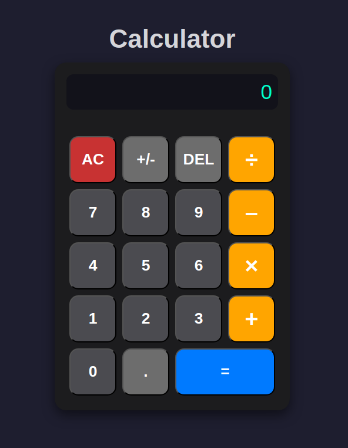

# 🧮 Modern JavaScript Calculator

A fully functional calculator application built with vanilla JavaScript, HTML, and CSS. Features a sleek dark theme interface with comprehensive keyboard and mouse support for seamless user interaction.


*Modern dark-themed calculator with cyan display and intuitive button layout*

## 📋 Project Summary

This calculator project demonstrates fundamental JavaScript concepts including event handling, state management, and DOM manipulation. The application handles complex user interaction patterns and maintains consistent state throughout various calculation scenarios.

**Expectations:**
- Perform basic arithmetic operations (+, -, ×, ÷)
- Handle decimal numbers with proper rounding
- Support both mouse clicks and keyboard input
- Maintain proper calculator behavior with error handling
- Provide visual feedback and intuitive user experience

## ✨ Features

### 🎯 Core Functionality
- ➕ **Basic Operations**: Addition, subtraction, multiplication, division
- 🔢 **Decimal Support**: Handle floating-point numbers with 2-decimal precision
- ⌨️ **Keyboard Support**: Full keyboard accessibility (numbers, operators, Enter, Backspace)
- 🖱️ **Mouse Support**: Complete button interface
- 🔄 **Chained Operations**: Continue calculations without clearing (e.g., 5 + 3 × 2)
- 🚫 **Error Handling**: Division by zero protection
- ⬅️ **Backspace**: Delete last entered digit
- ➕➖ **Sign Change**: Toggle positive/negative numbers
- 🎯 **Smart Decimal**: Prevents multiple decimal points

### 🎨 User Interface
- 🌙 **Dark Theme**: Modern dark interface with cyan accents
- ⚡ **Hover Effects**: Interactive button animations
- 📱 **Responsive Design**: Clean, centered layout
- 🔵 **Color Coding**: Different colors for operations, numbers, and functions

## 🛠️ Technologies Used

- **HTML5**: Semantic structure and accessibility
- **CSS3**: Modern styling with flexbox, hover effects, and custom properties
- **Vanilla JavaScript**: ES6+ features, event handling, and DOM manipulation
- **Event-Driven Architecture**: Multiple event listeners for comprehensive input handling

## 🧠 Core Problem-Solving Concepts

### 1. **State Management System**
The calculator uses multiple variables to track its current state:
- `number1`: First operand in calculation
- `number2`: Second operand in calculation  
- `operator`: Current arithmetic operation
- `result`: Previous calculation result
- `justClickedOperator`: Boolean flag for input mode switching

### 2. **Boolean Flag Pattern**
```javascript
let justClickedOperator = false;  // Controls input behavior
```
This flag determines whether the next digit input should:
- **Overwrite** the display (after operator click)
- **Append** to existing display (normal typing)

### 3. **Event-Driven State Transitions**
Different user actions trigger specific state changes:
- **Digit clicks**: Update display, handle overwrite vs append logic
- **Operator clicks**: Store operands, perform calculations, set flags
- **Equals clicks**: Execute final calculation, reset for next operation

### 4. **Input Mode Switching**
The calculator intelligently switches between different input modes:
- Building first number
- Accepting operator
- Building second number
- Displaying results

## 📝 Pseudocode

### Main Calculator Logic Flow

```
INITIALIZE calculator state:
    number1 = ""
    number2 = ""
    result = ""
    operator = ""
    justClickedOperator = false

WHEN user clicks digit button:
    IF (building first number):
        append digit to display
    ELSE IF (user wants fresh start after equals):
        clear old data, start new number
    ELSE IF (just clicked operator):
        overwrite display with new digit
        reset operator flag
    ELSE:
        append digit to display (building second number)

WHEN user clicks operator button:
    IF (first operator click):
        store display as number1
        store operator
        set justClickedOperator flag
    ELSE IF (user changes operator):
        update operator only
    ELSE IF (ready to calculate):
        perform calculation
        display result
        prepare for next operation
    ELSE IF (chaining operations):
        use previous result as number1

WHEN user clicks equals:
    IF (division by zero):
        display "ERROR"
    ELSE IF (ready to calculate):
        perform calculation
        display result
        reset for next operation

FUNCTION operate(operator, num1, num2):
    SWITCH operator:
        CASE "+": return add(num1, num2)
        CASE "-": return subtract(num1, num2)
        CASE "*": return multiply(num1, num2)
        CASE "/": return divide(num1, num2)

FUNCTION add/subtract/multiply/divide(x, y):
    result = perform operation
    IF result has decimals:
        return result rounded to 2 decimal places
    ELSE:
        return whole number
```

## 📊 State Transition Table

Understanding how the calculator behaves in different scenarios:

| User Action | Current State | number1 | operator | result | Display | justClickedOperator | Next State |
|-------------|---------------|---------|----------|--------|---------|-------------------|------------|
| Click "1" | Fresh start | "" | "" | "" | "1" | false | Building number1 |
| Click "2" | Building number1 | "" | "" | "" | "12" | false | Building number1 |
| Click "+" | Building number1 | "12" | "+" | "" | "12" | true | Operator selected |
| Click "3" | Operator selected | "12" | "+" | "" | "3" | false | Building number2 |
| Click "4" | Building number2 | "12" | "+" | "" | "34" | false | Building number2 |
| Click "=" | Building number2 | "12" | "+" | "46" | "46" | false | Result displayed |
| Click "×" | Result displayed | "46" | "×" | "46" | "46" | true | Chaining operations |
| Click "2" | Chaining operations | "46" | "×" | "46" | "2" | false | Building number2 |
| Click "=" | Building number2 | "46" | "×" | "92" | "92" | false | Final result |

### 🔍 Detailed Example: "12 + 34 ="

| Step | Action | number1 | operator | number2 | result | Display | Flag | Logic Applied |
|------|--------|---------|----------|---------|--------|---------|------|---------------|
| 1 | Click "1" | "" | "" | "" | "" | "1" | false | Building first number |
| 2 | Click "2" | "" | "" | "" | "" | "12" | false | Continue building |
| 3 | Click "+" | "12" | "+" | "" | "" | "12" | true | Store number1, set operator |
| 4 | Click "3" | "12" | "+" | "" | "" | "3" | false | Overwrite display (flag reset) |
| 5 | Click "4" | "12" | "+" | "" | "" | "34" | false | Append to number2 |
| 6 | Click "=" | "12" | "+" | "34" | "46" | "46" | false | Calculate and display result |

## 🏗️ Project Structure

```
calculator-project/
├── index.html          # HTML structure
├── style.css           # Styling and layout
├── script.js           # Calculator logic
├── README.md           # This file
└── screenshot.png      # Calculator preview
```

## 🚀 Getting Started

1. **Clone or Download** the project files
2. **Open** `index.html` in your web browser
3. **Start Calculating!** Use mouse clicks or keyboard input

### Keyboard Shortcuts
- **Numbers**: `0-9` keys
- **Operations**: `+`, `-`, `*`, `/` keys
- **Equals**: `Enter` or `=` key
- **Decimal**: `.` key
- **Delete**: `Backspace` or `Delete` key

## 🎨 Design Features

- **Dark Theme**: Easy on the eyes with `#1e1e2f` background
- **Cyan Display**: Bright `#00ffcc` text for excellent readability
- **Button Animations**: Smooth `scale(1.08)` hover effects
- **Color Psychology**: Orange operators, blue equals, red clear button
- **Modern Typography**: Inter font family for clean appearance

## 🐛 Error Handling

- **Division by Zero**: Displays "ERROR" message
- **Invalid Operations**: Graceful fallback to "Unknown operator"
- **Input Validation**: Prevents multiple decimals, handles edge cases
- **State Recovery**: Clear button resets all calculator state

## 🔮 Future Enhancements

- 📊 Calculation history
- 🧮 Scientific functions (sin, cos, tan, etc.)
- 💾 Memory operations (M+, M-, MR, MC)
- 📋 Copy result to clipboard
- ⌨️ More keyboard shortcuts
- 🎨 Theme customization
- 📱 Mobile app version

## 🤝 Contributing

1. Fork the repository
2. Create a feature branch (`git checkout -b feature/amazing-feature`)
3. Commit changes (`git commit -m 'Add amazing feature'`)
4. Push to branch (`git push origin feature/amazing-feature`)
5. Open a Pull Request


**Built with ❤️ and lots of ☕ by a JavaScript enthusiast**

*Feel free to star ⭐ this project if you found it helpful!*